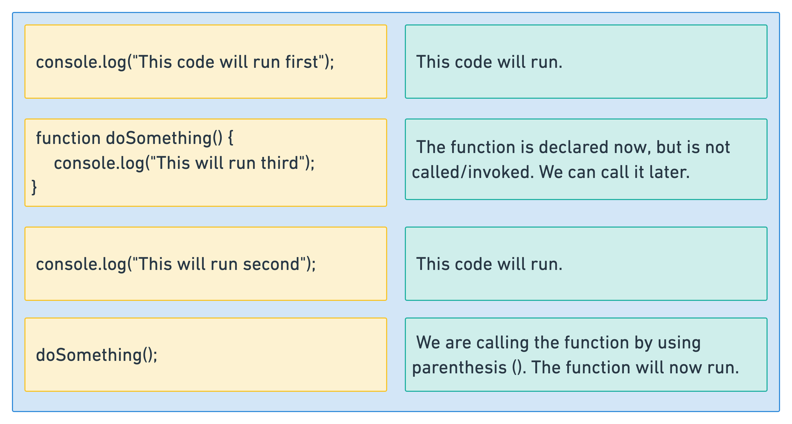

# Functions

When JavaScript loads in the browser, the browser will run the code as it finds it, from top to bottom.

As soon as the browser encounters this code it will run:

```js
console.log("hello");
```

A lot of the time we don't want our code to run immediately, but at a later time. We can use functions for this.

To use functions, we must both declare them (actually write them) and then invoke them (call them):

```js
// declare the function
function doSomething() {
    console.log("I'm in the function");
}
```

Above, we declared the function and now the browser will know about it. But it won't run it until it is called. We call a function by using parenthesis ().

```js
// call/invoke the function
doSomething();
```

Now the function called `doSomething` will be run by the browser.



## Arguments

Most of the time we want to pass variables into our functions so that the functions can act on them.

When we use `console.log`, we are passing a `string` variable into the `log` function. The `log` function then prints that variable out.

```js
console.log("I am an argument");
```

The variables that we pass in to functions are called arguments. When we declare the function we can call the argument(s) whatever we want:

```js
function doSomething(chickens) {}
```

We can then act on the arguments that we pass in to the function:

```js
//declare the function
function doSomething(chickens) {
    console.log(chickens);
}

// call the function
doSomething("Hello!");
```

Instead of hardcoding the message in our `console.log`, it will log the argument that we pass in to the function.

`chickens` is not a great name for our argument though. Let's make it something sensible:

```js
function doSomething(message) {
    console.log(message);
}

doSomething("Hello!");
```

### Mulitple arguments

Functions can have zero, one or more arguments. Above, our `doSomething` function had only one argument. Let's write a function with two:

```js
// declare a function with two arguments
function AddTwoNumbers(number1, number2) {
    const sum = number1 + number2;
    console.log(sum);
}

// call the function and pass two arguments in
AddTwoNumbers(3, 4);
// 7
```

Let's pass in two arguments to our `console.log` function too:

```js
function AddTwoNumbers(number1, number2) {
    const sum = number1 + number2;
    console.log("Result:", sum);
}

// we'll now have a label for our sum variable in our console.log
AddTwoNumbers(3, 4);
// Result: 7
```

## The return statement

Sometimes you want to return a value from the function so that you can use it elsewhere.

Let's return our variable `sum` from the function:

```js
function AddTwoNumbers(number1, number2) {
    const sum = number1 + number2;
    return sum;
}
```

Now we are getting the variable `sum` back from the function and we can assign it another variable.

```js
//we call the function and assign its return value to our variable "result"
const result = AddTwoNumbers(3, 4);

console.log(result);
// 7
```

When a `return` statement is encountered, the function exits. Nothing will run after the return.

```js
function AddTwoNumbers(number1, number2) {
    const sum = number1 + number2;
    return sum;
    // nothing runs after a return
    // so the console.log below will never execute
    console.log("This will never run");
}
```
